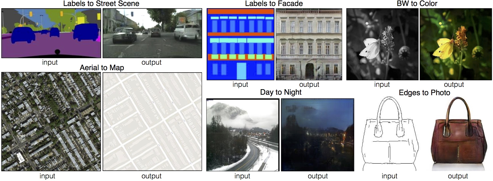
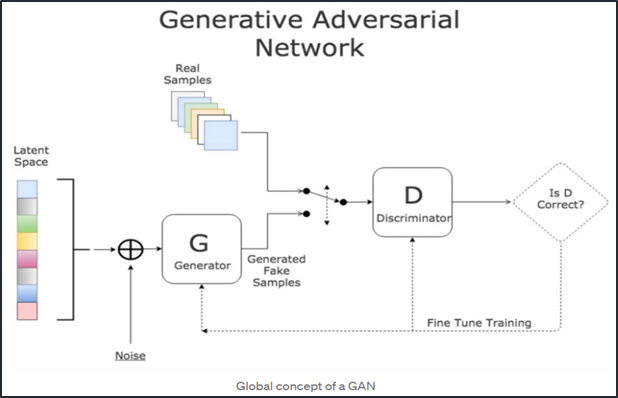

# Pix2Pix Implementation in PyTorch

The Pix2Pix GAN is a general approach for image-to-image translation. It is based on the conditional generative adversarial network, where a target image is generated, conditional on a given input image. In this case, the Pix2Pix GAN changes the loss function so that the generated image is both plausible in the content of the target domain, and is a plausible translation of the input image.

## Applications of Pix2Pix

 

## Pix2Pix 
---

     

~~~

class Pix2Pix(nn.Module):

    def __init__(self, in_channels, out_channels, device, learning_rate=0.0002, save_after=5, LOAD_MODEL=None):

        self.generator = UNet(in_channels).float().to(device)
        self.discriminator = PathGan(
            in_channels + out_channels).float().to(device)
        self.gen_opt = torch.optim.Adam(
            self.generator.parameters(), lr=learning_rate)
        self.disc_opt = torch.optim.Adam(
            self.discriminator.parameters(), lr=learning_rate)

        self.adversarial_criterion = nn.BCEWithLogitsLoss()
        self.recon_criterion = nn.L1Loss()

~~~
